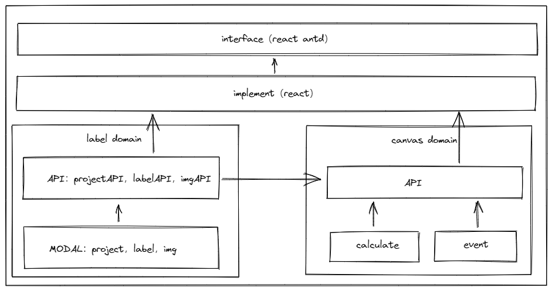

# 设计文档

## 介绍

图片标注组件，headless 组件，界面可高度自定义

## 使用场景

图片标注的显示和编辑，可用于 OCR 相关的功能

## 大概思路

本组件使用 headless 方法，与 ui 解耦，界面可高度自定义化

并将功能的实现与框架相关的实现分离，脱离实现层可以做到与框架无关


## 具体实现



### label domain

标注相关的模型和方法都在这里实现

### canvas domain

canvas 相关的方法都在这里实现

calculate 中实现图像计算的一些方法

event 中实现事件的绑定和解绑

### implement

通过 domian 层的方法暴露的 api 实现 hook 方法，做一些数据的缓存和暴露出去图片标注的方法

### interface

完全由用户自定义


# 快速开始

## 介绍

图片标注组件，用于图片上有对应方框标注的显示和编辑

界面可高度自定义化，本组件通过 hook 暴露的相关 api 方法实现对应的功能

## 安装方法

```bash
yarn add img-ocr-marker
or
npm install img-ocr-marker
```

## API

### zoomInImg2x

**放大图片（2 倍）**

调用该方法可以放大图片两倍，居中放大

```tsx | pure
<button onClick={zoomInImg2x}>zoom in</button>
```

### zoomOutImgHalf

**缩小图片（0.5 倍）**

调用该方法可以缩小图片 0.5 倍，居中缩小

```tsx | pure
<button onClick={zoomOutImgHalf}>zoom out</button>
```

### startDrag

**使用拖拽功能**

调用该方法可以在 canvas 中拖动图片

```tsx | pure
<button onClick={startDrag}>drag</button>
```

### startSelect

**使用选择功能**

调用该方法可以在 canvas 中选择一个标注（focus 状态）

```tsx | pure
<button onClick={startSelect}>drag</button>
```

### startMark

**使用标注功能**

调用该方法可以在 canvas 中对已经处于 focus 的标注，重新编辑这个标注在图片中所在的位置

同时启用标注功能后，也会判断框中是否存在多个标注，如果存在多个标注，则会合并这些标注

```tsx | pure
<button onClick={startMark}>drag</button>
```

### startMarkWithCallback

**使用标注功能(回调)**

需要传入回调函数，在标注结束后会调用该函数，并传入标注框在图上的坐标 coord 和网页里真实的坐标 position

已屏蔽 click 事件

```tsx | pure
import type {AfterMarkCallbackType}from '@tms/img-ocr-marker/dist/Domains/CanvasDomain/api'

const handleAfterMark: AfterMarkCallbackType = ...
...
<button onClick={startMarkWithCallback(handleAfterMark)}>startMarkWithCallback</button>
```

### clearRect

**清除 canvas 中的操作框**

调用该方法可以将 canvas 中的操作框去除

```tsx | pure
<button onClick={clearRect}>clearRect</button>
```

### endOperate

**手动关闭所有编辑的操作（拖拽，选择，标注）**

```tsx | pure
<button onClick={endOperate}>drag</button>
```

### focusMark

**focus 一个标注**

```tsx | pure
<div
  key={label.id}
  style={{ border: '1px solid black' }}
  onClick={() => focusMark(label)}
>
  {label.content}
</div>
```

### editMarkContent

**编辑一个标注的文本**

如果该标签 isFocus 为 true 会自动触发 focus 标注

```tsx | pure
<button
  onClick={() =>
    editMarkContent({ ...(data?.labelList[0] as any), content: 'edited' })
  }
>
  edit first
</button>
```

### deleteMarkFn

**删除一个标注**

注意：如果不传任何 label 对象，则会删除 focus 的标注（可用于图上面的工具栏）；如果传了 label 对象则会指定删除该对象

```tsx | pure
<button onClick={() => deleteMarkFn()}>delete focused</button>
```

### addMarkFn

**增加一个标签**

如果该标签 isFocus 为 true 会自动触发 focus 标注

```tsx | pure
<button
  onClick={() =>
    addMarkFn({
      id: generateUniqueId(),
      coord: { minX: 0, minY: 0, maxX: 0, maxY: 0 },
      content: 'test',
      isFocus: true,
      isEdit: true,
    })
  }
>
  add one
</button>
```

### sortMarks

**排序**

注意：支持自定义排序，传入排序方法即可，默认从上到下，从左到右进行排序

```tsx | pure
<button onClick={() => sortMarks()}>sort</button>
```

### operate

**操作状态**

内置是否正在拖拽（isDraging），是否正在选择（isSelecting），是否正在标注（isMarking），是否正在待回调的标注（isMarkCallback）可以拿这些状态进行界面的展示

```tsx | pure
<button>{operate.isDraging ? '正在拖拽' : '开始拖拽'}</button>
```

## 配置项

### needCalculateScroll

**框选时是否计算滚动距离**

默认值为 false

适用于在外层 div 有滚动条的情况，目前只计算 canvas 外三层的滚动距离

启用后框选性能会略微下降

```tsx | pure
const apis = useImgMarker({
  data,
  containerRef: containerRef.current,
  setData,
  settings: {
    needCalculateScroll: true,
  },
});
```

## 每个项目 data 的配置项

### borderColor

**边框颜色**

### editedBorderColor

**编辑后的边框颜色**

### focusBorderColor

**选中后的边框颜色**

## 基本用法

用该组件写的一个简陋的 demo

在图上拖拽，点击选择和框选需要点击按钮后启用该功能

点击右边列表里的单项可以编辑

```ts | pure
const {
  // 各种 API
  zoomInImg2x,
  zoomOutImgHalf,
  startDrag,
  endOperate,
  startSelect,
  startMark,
  startMarkWithCallback,
  clearRect,

  focusMark,
  editMarkContent,
  deleteMarkFn,
  addMarkFn,
  sortMarks,
  operate,
} = useImgMarker({
  data, // ProjectInterface 类型可以从 @tms/img-ocr-marker/dist/Domains/MarkDomain/modal 引入
  containerRef: containerRef.current, // 想要显示 canvas 的 div 标签，canvas 宽高都将以这个 div 为准
  setData, // data 的 setter
});
```

## preview 预览模式 WIP

纯预览模式，目前用 useImgMarker hook 包了一层

```ts | pure
const {
  // 各种 API
  zoomInImg2x,
  zoomOutImgHalf,
  startDrag,
} = useImgPreviewer({
  img, // ProjectInterface 中的 img 类型
  containerRef: containerRef.current, // 想要显示 canvas 的 div 标签，canvas 宽高都将以这个 div 为准
  coords, // 想要画框的坐标
});
```
