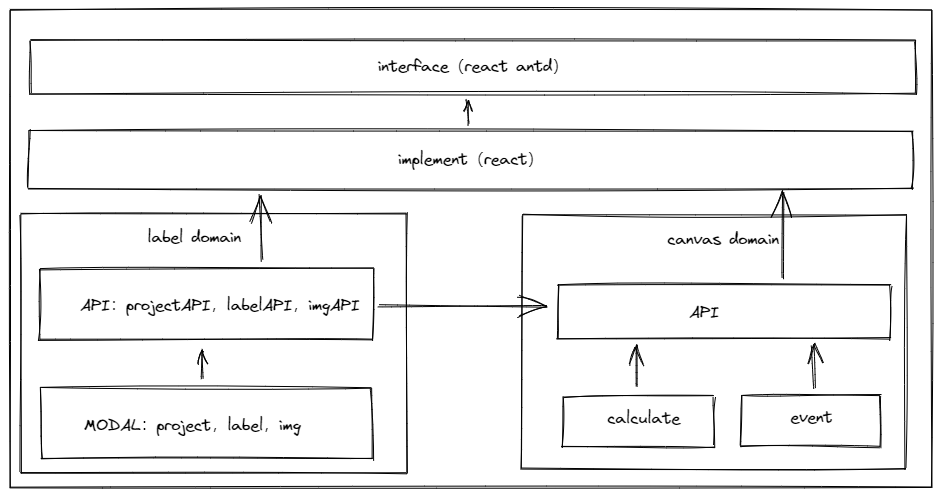

# 设计文档

## 大概思路

本组件使用 headless 方法，与 ui 解耦，界面可高度自定义化

并将功能的实现与框架相关的实现分离，脱离实现层可以做到与框架无关

## 具体实现

### label domain

标注相关的模型和方法都在这里实现

### canvas domain

canvas 相关的方法都在这里实现

calculate 中实现图像计算的一些方法

event 中实现事件的绑定和解绑

### implement

通过 domian 层的方法暴露的 api 实现 hook 方法，做一些数据的缓存和暴露出去图片标注的方法

### interface

完全由用户自定义
